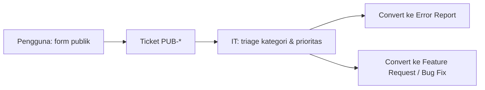

# Public Submission Form - Quick Start

## Overview

Form laporan sederhana tanpa login. Pengguna hanya isi judul, detail, nama, unit, dan bukti gambar. Tim IT melakukan triage di halaman **Tickets**.

## URLs

| Audience | URL |
|----------|-----|
| Pengguna (publik) | `https://your-domain.com/public/submit` |
| IT (dashboard) | `https://your-domain.com/` → login → **Tickets** / **Public Form** |

## Form Fields (publik)

| Field | Wajib |
|-------|-------|
| Nama pelapor | ✅ |
| Unit / departemen | ✅ |
| Judul laporan | ✅ |
| Keterangan detail | ✅ |
| Bukti gambar | Opsional (maks. 5×10MB) |

## Alur bisnis



## Env

- Backend: `PUBLIC_SUBMISSION_API_KEY`
- Frontend: `VITE_PUBLIC_API_KEY` (harus sama)

## Share template

```
Laporkan masalah IT: https://your-domain.com/public/submit
Isi nama, unit, judul, dan keterangan. Tim IT akan menindaklanjuti.
```

---

**Last Updated**: 09 Juli 2026
